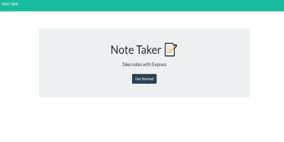

## NOTE TAKER

# Screenshot of App

## DESCRIPTION

This App was created with HTML, CSS, and JavaScript, and allows the user to keep detailed notes about things they
may otherwise forget. After all, people are busy, and this app can alleviate the irritation that occurs when something
important is forgotten. Users can create notes, edit notes, and delete notes as desired.

## TABLE OF CONTENTS

- [Description](#description)
- [Installation](#Installation)
- [License](#License)
- [Usage](#Usage)
- [Credits](#Credits)
- [Contributing](#Contributing)
- [Tests](#Tests)
- [Questions](#Questions)

## INSTALLATION

To install the dependencies necessary for this project, run the following command:

- npm i

## LICENSE

- This project is licensed under the MIT license.

## USAGE

- This project requires Requires node v14+ to run.

## Credits

## CONTRIBUTING

- Pull requests are welcome. For major changes, please open an issue first to discuss what you would like to change.
- Please make sure to update tests as appropriate.

## TESTS

- npm test

## QUESTIONS

- If you have any questions, I can be reached through me email at slevalley@gmail.com. My GitHub profile can be viewed at at
  [sjlevalley](https://www.github.com/sjlevalley).
